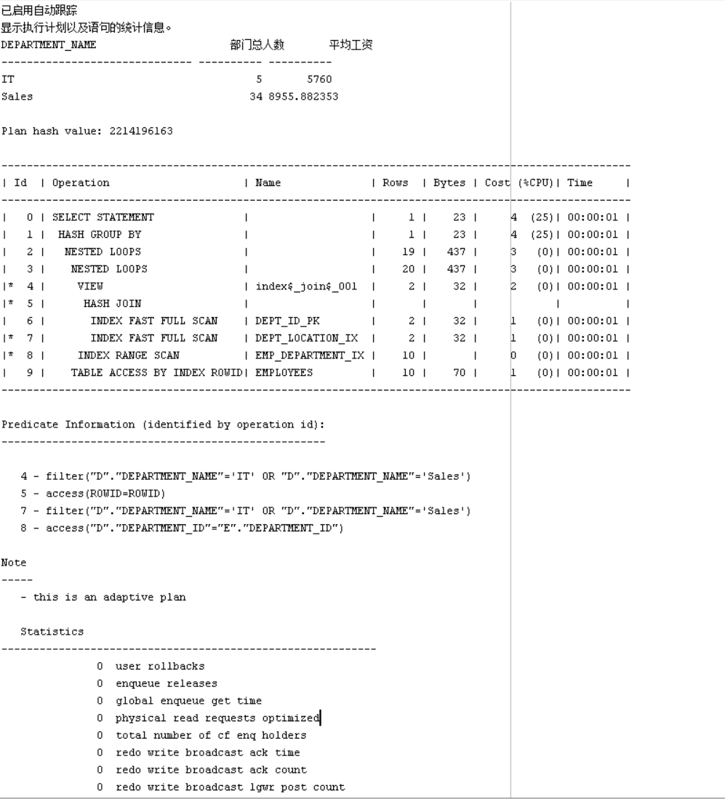
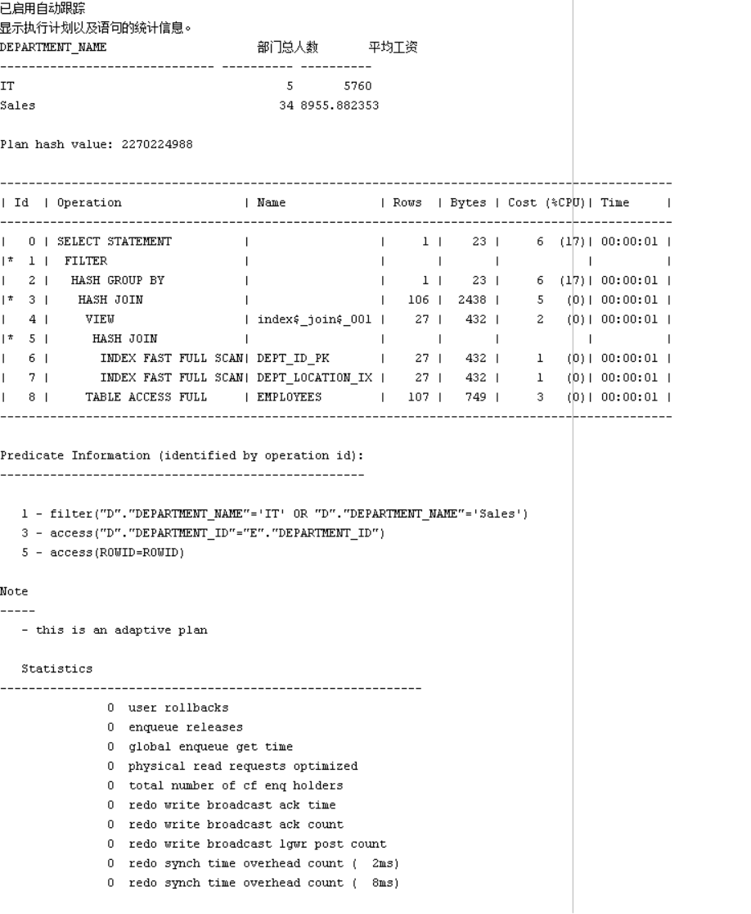
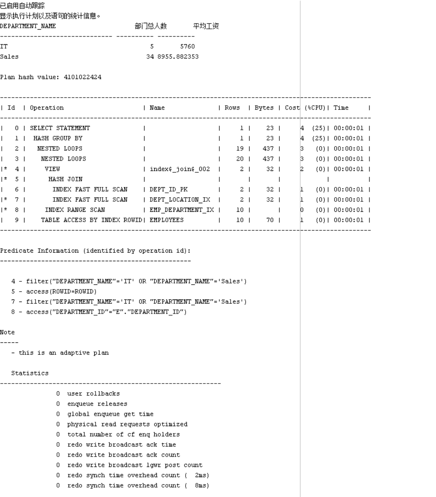

- ## 运行代码

```sql
set autotrace on

SELECT d.department_name,count(e.job_id)as "部门总人数",
avg(e.salary)as "平均工资"
from hr.departments d,hr.employees e
where d.department_id = e.department_id
and d.department_name in ('IT','Sales')
GROUP BY d.department_name;


```

- ## 结果




- ## 运行代码

```sql
set autotrace on

SELECT d.department_name,count(e.job_id)as "部门总人数",
avg(e.salary)as "平均工资"
FROM hr.departments d,hr.employees e
WHERE d.department_id = e.department_id
GROUP BY d.department_name
HAVING d.department_name in ('IT','Sales');

```

- ## 结果




- ## 代码分析

```
比较两个SQL语句，发现查询语句1相对于查询语句2来说，语句1的效率要高一些：因为语句1是先进行条件的判断，然后进行筛选，最后得出结果；而语句2则进行了两次筛选，浪费资源。
```

- ## 代码优化

```sql
set autotrace on
SELECT c.department_name,count(e.job_id)as "部门总人数",
avg(e.salary)as "平均工资"
from (SELECT department_name,department_id
    from hr.departments
    WHERE department_name in('IT','Sales'))c ,hr.employees e
WHERE c.department_id = e.department_id 
GROUP BY c.department_name
```

- ## 结果

