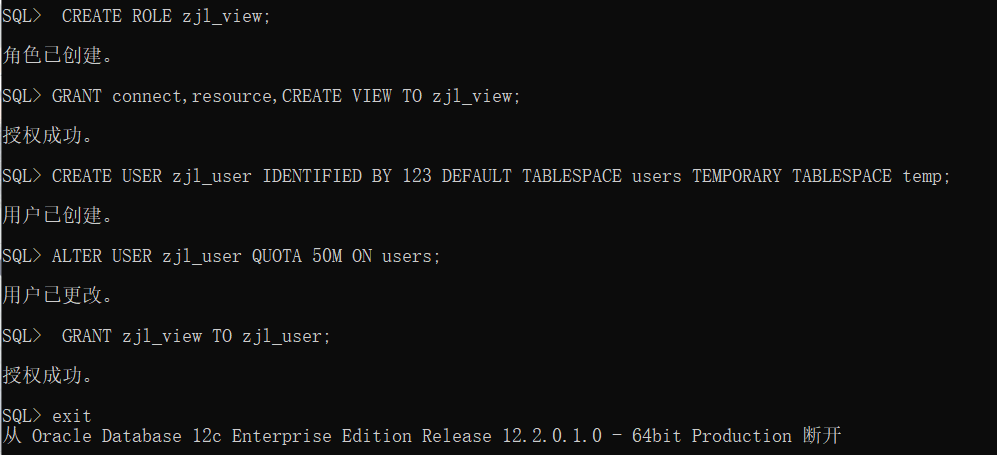
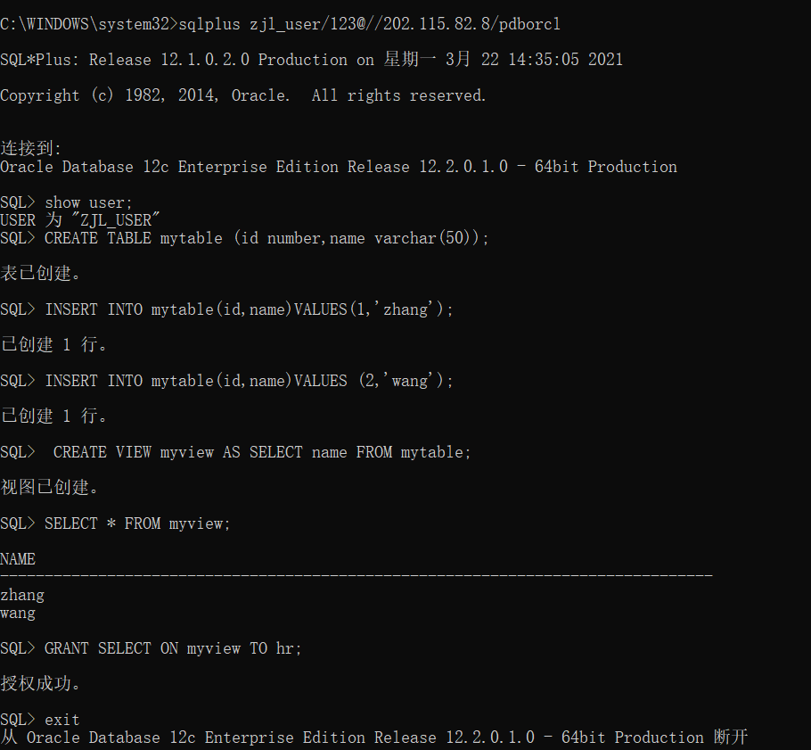
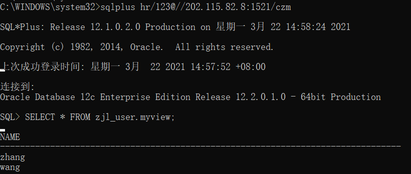
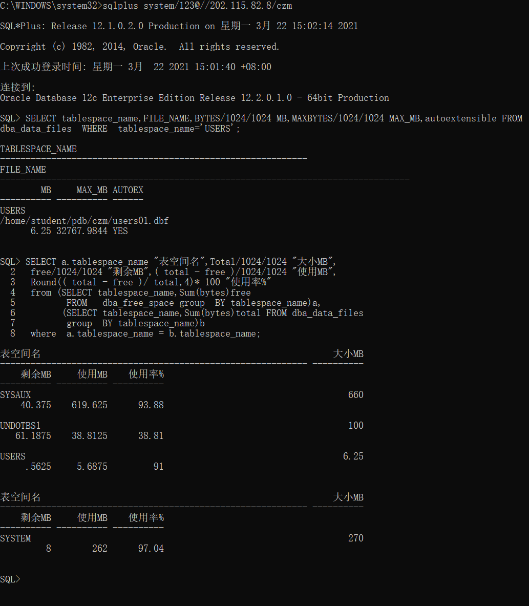

# 实验2：用户及权限管理

### 学号：201810414230 姓名:赵佳乐    班级：201810414230

## 实验目的

掌握用户管理、角色管理、权根维护与分配的能力，掌握用户之间共享对象的操作技能。

## 实验步骤

对于以下的对象名称con_res_view，new_user，在实验的时候应该修改为自己的名称。

- 第1步：以system登录到pdborcl，创建角色con_res_view和用户new_user，并授权和分配空间：
- 

- 第2步：新用户new_user连接到pdborcl，创建表mytable和视图myview，插入数据，最后将myview的SELECT对象权限授予hr用户。
  
  
  
- 第3步：用户hr连接到pdborcl，查询new_user授予它的视图myview

### 查看数据库的使用情况

以下样例查看表空间的数据库文件，以及每个文件的磁盘占用情况。

- autoextensible是显示表空间中的数据文件是否自动增加。
- MAX_MB是指数据文件的最大容量。

## 实验总结

这次实验通过远程连接老师的oracle数据库，学会了oracle数据库的角色管理，用户授权的使用方法，能通过系统用户system创建了一个自己的角色和用户。

