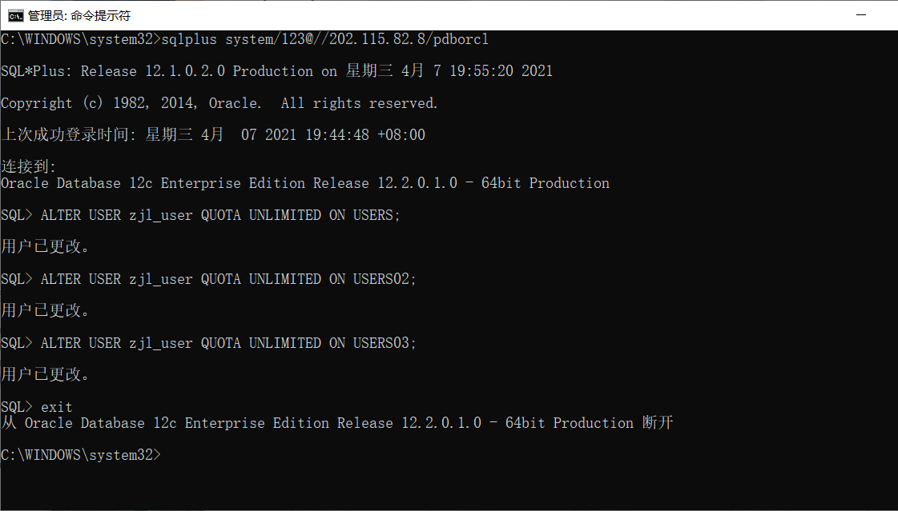
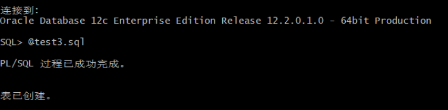
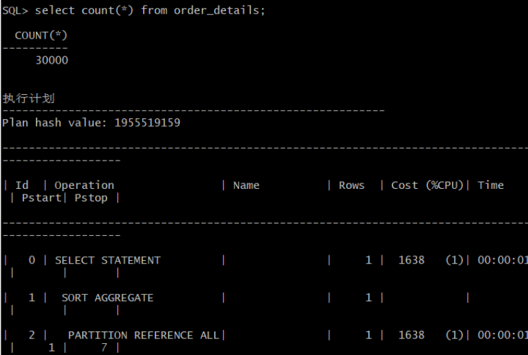
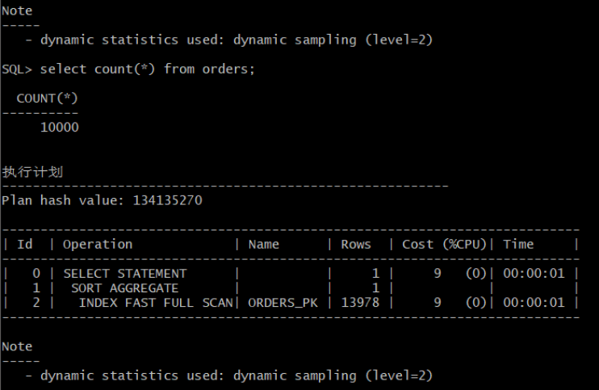
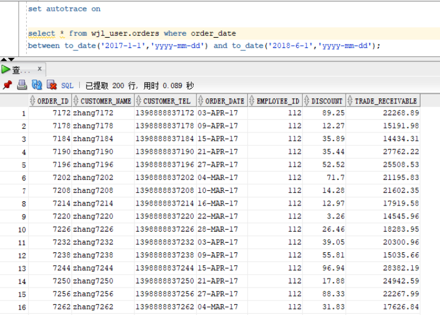
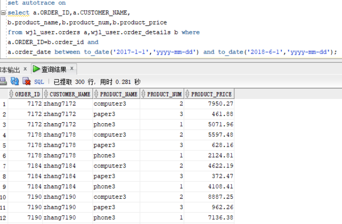
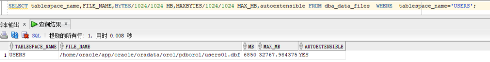
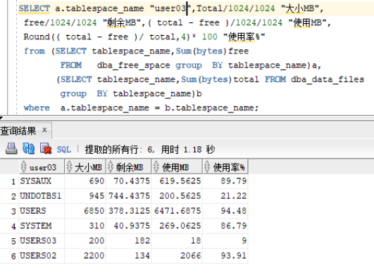
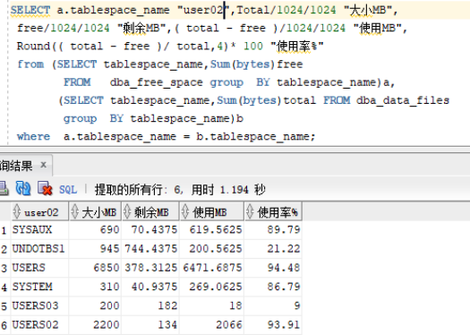

# 实验3：创建分区表

### 学号：201810414230 姓名:赵佳乐    班级：201810414230

## 实验目的

掌握分区表的创建方法，掌握各种分区方式的使用场景。

## 实验内容

- 本实验使用3个表空间：USERS,USERS02,USERS03。在表空间中创建两张表：订单表(orders)与订单详表(order_details)。
- 使用**你自己的账号创建本实验的表**，表创建在上述3个分区，自定义分区策略。
- 你需要使用system用户给你自己的账号分配上述分区的使用权限。你需要使用system用户给你的用户分配可以查询执行计划的权限。
- 表创建成功后，插入数据，数据能并平均分布到各个分区。每个表的数据都应该大于1万行，对表进行联合查询。
- 写出插入数据的语句和查询数据的语句，并分析语句的执行计划。
- 进行分区与不分区的对比实验。

## 实验步骤

- #### 更改用户状态

- #### 登录zjl_user，运行test3.sql

- #### 运行结果查看

- #### 以system用户运行，简单查询和联表查询

单表查询

](h

 联表查询

- #### 查看表空间和数据库文件及其磁盘占用情况

  

​	autoextensible是显示表空间中的数据文件是否自动增加。

​	MAX_MB是指数据文件的最大容量。

## 实验总结

这次实验学会了怎么去设计分区表，创建表后自定义分区，能够插入数据和查询数据。
