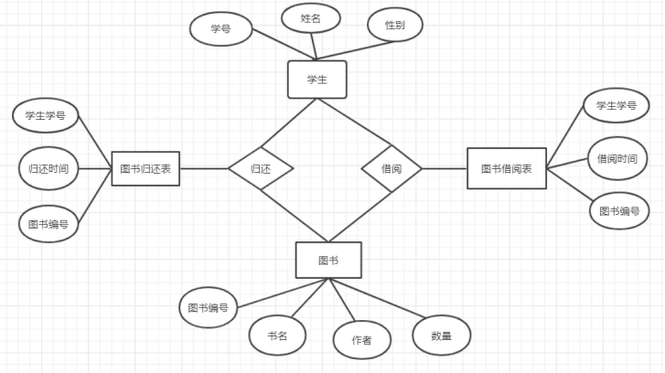
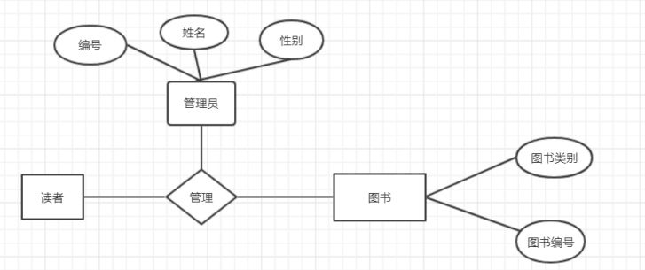

# 姓名：赵佳乐

# 学号：201810414230

# 班级：软件工程2018级2班

# 图书管理系统数据库设计

## 一、引言

在图书馆的正常运行中，面临着大量的图书、读者信息和借阅、还书信息之间的互动产生。Oracle数据库系统是目前世界上流行的关系数据库管理系统，系统可移植性好、使用方便、功能强，适用于各类大、中、小、微机环境。它是一种高效率、可靠性好的、适应高吞吐量的数据库方案。本系统是基于Oracle数据库的图书管理系统的数据库设计。

## 二、概念模型设计

### 2.1 E-R图设计

 

​                                                                        读者E-R模型

 

​                                                                     管理员E-R模型

 

### 2.2 表空间设计

   创建一个表空间USERS02，用于保存书籍管理系统的各种表，首先需要定义数据文件的存储地址，并且定义该数据文件的大小为200M、的分配方式为自动扩展、表空间的管理方式为本地管理。

### 2.3 数据表设计

创建五个表，存储在表空间users中。这五个表是学生表、图书表、借阅表和管理员表，书籍种类表。

学生表的作用是存放学生信息，学号，学生姓名，等等学生相关的信息。

图书表的作用是存放图书信息，编号，书名，作者，价格等图书的相关信息。

借阅表的作用是对学生表和图书表的一个链接，显示哪些人借的哪些书。借阅的日期和还书日期等信息。

书籍种类表的作用是将图书表的书进行分类，存放种类编号，种类名等信息。

管理员信息表的作用是用于存放管理员的账号，密码，姓名，加入日期等相关信息。


## 三、数据库表

### 3.1 书籍表设计

| 字段名    | 数据类型          | 可以为空 | 注释                   |
| --------- | ----------------- | -------- | ---------------------- |
| bookno    | Number(10,0)      | no       | 书籍编号，主键         |
| bookname  | Varchar2(20,BYTE) | no       | 书名                   |
| bookclass | Varchar2(20,BYTE) | no       | 书的种类，书种类表外键 |
| writer    | Varchar2(20,BYTE) | no       | 作者                   |
| price     | Number(10,0)      | no       | 价格                   |

 

### 3.2 书的种类表设计

| 字段名    | 数据类型          | 可以为空 | 注释                 |
| --------- | ----------------- | -------- | -------------------- |
| classno   | Number(10,0)      | no       | 书籍种类的编号，主键 |
| classname | Varchar2(20,BYTE) | no       | 书籍的种类名         |

 

### 3.3 管理员表设计

| 字段名    | 数据类型          | 可以为空 | 注释             |
| --------- | ----------------- | -------- | ---------------- |
| Adminname | Varchar2(20,BYTE) | no       | 管理员账号，主键 |
| pwd       | Varchar2(20,BYTE) | no       | 管理员密码       |
| mname     | Varchar2(20,BYTE) | no       | 管理员姓名       |
| Join_date | DATE              | no       | 加入日期         |

 

 

### 3.4借阅信息表设计

| 字段名      | 数据类型           | 可以为空 | 注释                 |
| ----------- | ------------------ | -------- | -------------------- |
| bookno      | Varchar2(200,BYTE) | N0       | 书籍编号，书籍表外键 |
| studyno     | Varchar2(200,BYTE) | N0       | 学生学号，学生表外键 |
| Borrow_date | Varchar2(20,BYTE)  | N0       | 借书日期             |
| Return_date | Varchar2(20,BYTE)  | N0       | 还书日期             |

 

### 3.5 学生信息表设计

| 字段名   | 数据类型          | 可以为空 | 注释           |
| -------- | ----------------- | -------- | -------------- |
| username | Varchar2(20,BYTE) | no       | 学生账号       |
| studyno  | Number(10,0)      | no       | 学生学号，主键 |
| name     | Varchar2(10,BYTE) | no       | 学生姓名       |
| password | Varchar2(20,BYTE) | no       | 学生密码       |
| phone    | Number(20,0)      | no       | 学生电话       |


 

## 四.物理结构设计

### 创建表空间

#### 第一个表空间

```
Create Tablespace space_zjl001

datafile

'/home/oracle/app/oracle/oradata/orcl/pdborcl/pdbtest_zjl001_1.dbf'

 SIZE 100M AUTOEXTEND ON NEXT 256M MAXSIZE UNLIMITED,

'/home/oracle/app/oracle/oradata/orcl/pdborcl/pdbtest_zjl001_2.dbf'

 SIZE 100M AUTOEXTEND ON NEXT 256M MAXSIZE UNLIMITED

EXTENT MANAGEMENT LOCAL SEGMENT SPACE MANAGEMENT AUTO;
```

#### 第二个表空间

```
Create Tablespace space_zjl002

datafile

'/home/oracle/app/oracle/oradata/orcl/pdborcl/pdbtest_zjl002_1.dbf'

 SIZE 100M AUTOEXTEND ON NEXT 256M MAXSIZE UNLIMITED,

'/home/oracle/app/oracle/oradata/orcl/pdborcl/pdbtest_zjl002_2.dbf'

 SIZE 100M AUTOEXTEND ON NEXT 256M MAXSIZE UNLIMITED

EXTENT MANAGEMENT LOCAL SEGMENT SPACE MANAGEMENT AUTO;
```


### 创建表

#### 创建读者表

```
CREATE TABLE "SCOTT"."READER"

(

 "STUDENT_ID" INT PRIMARY KEY,

 "STUDENT_NAME" VARCHAR(10) NOT NULL,

 "STUDENT_GENDER" CHAR(2) NOT NULL,

 "STUDENT_AGE" INT NOT NULL,

 " STUDENT_PRO" VARCHAR(20) NOT NULL,

 " STUDENT_GRADE" VARCHAR(20) NOT NULL,

 " STUDENT_INTEGRITY" INT  DEFAULT 1 

) 

TABLESPACE " zjl001";

ALTER TABLE "SCOTT"."READER" ADD CONSTRAINTS "Sex_CK1" CHECK(Sex BETWEEN '男' AND '女');
```


#### 创建书籍表

```
CREATE TABLE "SCOTT"."BOOK"

(

 "BOOKNO" INT PRIMARY KEY,

 "BOOKNAME" VARCHAR(20) NOT NULL,

 "AUTHOR" VARCHAR(20) NOT NULL,

 "BOOKSTYLE" VARCHAR(20) NOT NULL,

 "BOOKNUM" INT NOT NULL,

 "BOOKSORT" VARCHAR(40) NOT NULL,

 " BOOKRECORD" DATETIME 

) 
TABLESPACE " zjl001";
```


#### 创建管理者表

```
CREATE TABLE "SCOTT"."MANAGER"

(

 "MANAGER_ID" INT PRIMARY KEY,

 "MANAGER_NAME" VARCHAR(10) NOT NULL,

 "MANAGER_AGE" INT NOT NULL，

 " MANAGER_PASSWORD" VARCHAR(20) NOT NULL,

 " ANAGER_PHONE" VARCHAR(20) NOT NULL,) 

TABLESPACE " zjl001";
```


#### ***\*创建图书类别表\****

```
CREATE TABLE "SCOTT"."BOOK"

(

 "STYLE_NO" VARCHAR(10) PRIMARY KEY,

 "STYLE_NAME" VARCHAR(30) NOT NULLS

) 

TABLESPACE " zjl001";
```


#### ***\*创建借阅表\****

```
CREATE TABLE "SCOTT"."BORROW"

(

  "READER_ID" INT REFERENCES "SCOTT"."READER"( READER_ID),

  "BOOK_ID" INT REFERENCES "SCOTT"."BOOK"( BOOK_ID),

  "BORROW_DATE" DATETIME,

  "EXPECT_RETURN_DATE" DATETIME

)

TABLESPACE " zjl002";
```


#### ***\*创建归还表\****

```
CREATE TABLE "SCOTT"."RETURN"

( 

  "READER_ID" INT REFERENCES "SCOTT"."READER"( READER_ID),

  "BOOK_ID" INT REFERENCES "SCOTT"."BOOK"( BOOK_ID),

  "BORROW_DATE" DATETIME,

  "RETURN_DATE" DATETIME

)

TABLESPACE " zjl002";
```


## 五．数据库实施代码

### ***\*向表中插入数据\****

#### ***\*图书信息表\****

```
	declare
	j NUMBER;
	begin
	j:=1;
	for i in  1..1000
	loop

  insert into BOOK_INFOR(BOOKNO,BOOKNAME,BOOKSTYLE,AUTHOR,PUBLISH,PUBLISHDATE) values(j,'ruin sience','sience','m.j','qinghua',to_date('2015-09-18','yyyy-mm-dd'));j:=j+1;

  insert into BOOK_INFOR(BOOKNO,BOOKNAME,BOOKSTYLE,AUTHOR,PUBLISH,PUBLISHDATE) values(j,'go magazine','magazine','m.j','qinghua',to_date('2005-3-2','yyyy-mm-dd'));j:=j+1;

  insert into BOOK_INFOR(BOOKNO,BOOKNAME,BOOKSTYLE,AUTHOR,PUBLISH,PUBLISHDATE) values(j,'push textbook','textbook','m.j','qinghua',to_date('1903-3-2','yyyy-mm-dd'));j:=j+1;

  insert into BOOK_INFOR(BOOKNO,BOOKNAME,BOOKSTYLE,AUTHOR,PUBLISH,PUBLISHDATE) values(j,'ruin primer','primer','m.j','qinghua',to_date('2014-09-18','yyyy-mm-dd'));j:=j+1;

  insert into BOOK_INFOR(BOOKNO,BOOKNAME,BOOKSTYLE,AUTHOR,PUBLISH,PUBLISHDATE) values(j,'go instruction','instruction','m.j','qinghua',to_date('2003-3-2','yyyy-mm-dd'));j:=j+1;

   insert into BOOK_INFOR(BOOKNO,BOOKNAME,BOOKSTYLE,AUTHOR,PUBLISH,PUBLISHDATE) values(j,'push autobiography','autobiography','m.j','qinghua',to_date('1906-3-2','yyyy-mm-dd'));j:=j+1;

   insert into BOOK_INFOR(BOOKNO,BOOKNAME,BOOKSTYLE,AUTHOR,PUBLISH,PUBLISHDATE) values(j,'ruin fable','fable','m.j','qinghua',to_date('2019-09-18','yyyy-mm-dd'));j:=j+1;

   insert into BOOK_INFOR(BOOKNO,BOOKNAME,BOOKSTYLE,AUTHOR,PUBLISH,PUBLISHDATE) values(j,'go dictionary','dictionary','m.j','qinghua',to_date('2008-3-2','yyyy-mm-dd'));j:=j+1;

   insert into BOOK_INFOR(BOOKNO,BOOKNAME,BOOKSTYLE,AUTHOR,PUBLISH,PUBLISHDATE) values(j,'push reference','reference','m.j','qinghua',to_date('1908-3-2','yyyy-mm-dd'));j:=j+1;

   insert into BOOK_INFOR(BOOKNO,BOOKNAME,BOOKSTYLE,AUTHOR,PUBLISH,PUBLISHDATE) values(j,'push reference','reference','m.j','qinghua',to_date('1988-3-2','yyyy-mm-dd'));j:=j+1;

   end loop;
   commit;
   end;
```

 

#### ***\*学生信息表\****

 

```
    begin
    for i in  1..2000
    loop
     insert into STUDENT(STUDENTNO,STUDENTNAME,STUDENTSEX,ISBORROWED) values('201510415354','ZHUMAOJIE','MAN','YES');

      insert into STUDENT(STUDENTNO,STUDENTNAME,STUDENTSEX,ISBORROWED) values('201720418354','WULIUKA','WOMAN','NO');

     insert into STUDENT(STUDENTNO,STUDENTNAME,STUDENTSEX,ISBORROWED) values('201612416354','LIUFUT','WOMAN','YES');

     insert into STUDENT(STUDENTNO,STUDENTNAME,STUDENTSEX,ISBORROWED) values('201710415254','LIUCHEN','MAN','NO');
      insert into STUDENT(STUDENTNO,STUDENTNAME,STUDENTSEX,ISBORROWED) values('201612415824','WANGWU','MAN','YES');
   end loop;
   commit;
   end;
```

  

 

#### ***\*图书种类表\****

 

```
  begin

  for i in  1..2000

  loop

    insert into book_style(STYLENO,STYLENAME) values('1','magazine');

    insert into book_style(STYLENO,STYLENAME) values('2','textbook');

     insert into book_style(STYLENO,STYLENAME) values('3','primer');

    insert into book_style(STYLENO,STYLENAME) values('4','instruction');

    insert into book_style(STYLENO,STYLENAME) values('5','autobiography');

   end loop;

   commit;

  end;
```

 

#### ***\*借书还书表\****

```
  begin
    for i in  1..2000
    loop

      insert into BORROWRETURN_BOOK(READERNO,BOOKNO,BORROWDATE,RETURNDATE) values('201510415354','8742',to_date('2019-9-2','yyyy-mm-dd'),to_date('2019-10-2','yyyy-mm-dd'));

      insert into BORROWRETURN_BOOK(READERNO,BOOKNO,BORROWDATE,RETURNDATE) values('201710415354','1585',to_date('2019-6-2','yyyy-mm-dd'),to_date('2019-7-2','yyyy-mm-dd'));

      insert into BORROWRETURN_BOOK(READERNO,BOOKNO,BORROWDATE,RETURNDATE) values('201810415354','3547',to_date('2019-3-2','yyyy-mm-dd'),to_date('2019-4-2','yyyy-mm-dd'));

      insert into BORROWRETURN_BOOK(READERNO,BOOKNO,BORROWDATE,RETURNDATE) values('201910415354','3585',to_date('2019-7-2','yyyy-mm-dd'),to_date('2019-8-2','yyyy-mm-dd'));

      insert into BORROWRETURN_BOOK(READERNO,BOOKNO,BORROWDATE,RETURNDATE) values('201710415354','5857',to_date('2019-3-2','yyyy-mm-dd'),to_date('2019-6-2','yyyy-mm-dd'));

    end loop;

    commit;

end;
```

 

### 触发器设计

**1.** 设计触发器borrow，当某学生借书成功后﹐图书表相应的图书不在架上,变为0∶

```
create or replace trigger borrow
after insert on borrow
for each row
begin
update book set book_num = book_num -1
where book_id = new.book_id;
end borrow；
```

***\*⒉设计触发器\*******\*trigger_return，还书成功后﹐对应的书籍book_num变为1:\**** 

```
create or replace trigger trigger_return
after insert on return_table
for each row
begin
update book set book_num = book_num + 1
where book_id = new.book_id;
end trigger_return;
```

***\*3.定义定时器（事件) eventJob ,每天自动触发一次﹐扫描视图stu_borrow ，若发现当前有\****

***\*预期归还时间小于当前时间\*******\*,则判断为超期,生成处罚记录,这个定时器将每天定时触发存\****

***\*储过程\*******\*proc_gen_ticket :\****

```
create event if not exists eventJob

on schedule every 1 DAYl*每天触发**

on completion PRESERVE

do call proc_gen_ticket(getdate());l*调用存储过程*/

set global event_scheduler = 1;

alter event eventJob on completion preserve enable; *开启定时器
```


### ***\*储存函数包设计\****

#### ***\*创建程序包\****

```
create or replace PACKAGE book_package Is

function func_get_credit(stu_id int) returns int;

function func_get_booknum(book_id int) returns int;

procedure proc_return(in stu_id int, in book_id int, in return_date datetime);

procedure proc_payoff(in stuid int, in bookid int);

 procedure proc_borrow(in stu_id int,in book_id int,in borrow_date datetime);

procedure proc_gen_ticket(in currentdate datetime);

procedure stu_register(in stu_id int,in stu_name varchar(20)，in stu_sex varchar(20), in stu_age int, in stu_pro varchar(20), in stu_grade varchar(20));

procedure ma_register(in ma_id int, in ma_name varchar(20), in ma_age int, in ma_phone int);

end book_package;
```


#### ***\*创建\*******\*存储过程\****

```
create or replace PACKAGE body book_package Is

/* 1．设计存储过程，产生罚单proc_gen_ticket :

当日期超过预定归还日期时﹐产生罚单，并将记录写入表ticket中,这个存储过程在定时器

eventJob中调用:  */

 

procedure proc_gen_ticket(in currentdate datetime)

BEGIN

declare cur_date datetime;

set cur_date = currentdate;

replace into ticket(stu_id, book_id, over_date, ticket_fee)

select

stu_id,

book_id,

datediff(cur_date,stu_borrow.expect_return_date),0.1*datediff(cur_date,stu_borrow.exp

ect_return_date)

from stu_borrow

where cur_date>stu_borrow.expect_return_date;

end proc_gen_ticket;
```

/* ⒉设计学生注册信息存储过程∶学生注册信息stu_register  */

 

```
procedure stu_register(in stu_id int,in stu_name varchar(20)，in stu_sex

varchar(20), in stu_age int, in stu_pro varchar(20), in stu_grade varchar(20))

begin

insert into student(stu_id, stu_name, stu_sex,stu_age, stu_pro, stu_grade)

values(stu_id,stu_name, stu_sex,stu_age,stu_pro,stu_grade);

end stu_register;
```

/*  3.设计管理员注册信息存储过程:ma_register */

 

```
procedure ma_register(in ma_id int, in ma_name varchar(20), in ma_age int, in

ma_phone int)

BEGIN

insert into manager

values(ma_id, ma_name, ma_age, ma_phone);

END ma_register;
```

 

/*  4．借书过程的实现:

```
/*1)设计存储函数, func_get_credit ,返回学生的诚信级︰*/

function func_get_credit(stu_id int) returns int

begin

return(select stu_integrity from student where student.stu_id = stu_id);

end
```

 

```
/* 2)设计存储函数，func_get_booknum ,返回书籍是否在架上:*/

function func_get_booknum(book_id int) returns int

begin

return(select book_num from book where book.book_id = book_id);

end
```

 

```
/*3)设计存储过程proc_borrow ,调用 func_get_booknum ,判断这个书籍是否在架上,若为真,则借书成功,在borrrow表中插入纪录;否则提示失败︰*/

 

procedure proc_borrow(in stu_id int,in book_id int,in borrow_date datetime)

begin

if func_get_credit(stu_id)= 1 and func_get_booknum(book_id)= 1 then

insert into borrow

values(stu_id, book_id, borrow_date);

else

select 'failed to borrow';

end if;

end proc_borrow;
```

 

```
/* 4.还书存储过程proc_return :

当还书时,查看是否书是否超期,即查询ticket表项,当发现超期,提示交罚单后再次还书 ，

如没有超期，则纪录归还项目到return_table中，并且删除借书纪录(以免还书后定时器仍

然扫描这个纪录): */

procedure proc_return(in stu_id int, in book_id int, in return_date datetime)

begin

DECLARE borrowdate datetime;

if(select payoff from ticket where ticket.stu_id =stu_idand

ticket.book_id=book_id)= 1 then l*判断是否交了罚单﹐1表示没有交*

select 'please pay off the ticket';

elsel*纪录归还项目到return_table 中，并且删除借书纪录*/

set borrowdate = (select borrow_date from borrow where borrow.stu_id =

stu_id and borrow.book_id = book_id);

insert into return_table

values(stu_id, book_id, borrowdate, return_date);

delete from borrow

where borrow.stu_id = stu_id and borrow.book_id = book_id;

end if;

end proc_return;
```

 

### ***\*角色分配以及权限赋予\****

***\*创建学生用户：\****

```
create user student1

identified by 123

default tablespace users

quota 50M on users

password expire;

 

create user student2

identified by 123

default tablespace users

quota 50M on users

password expire;
```

 

***\*创建图书管理员用户：\****

```
create user manager1

identified by 123

default tablespace users

quota 50M on users

password expire;

 

 create user manager2

identified by 123

default tablespace users

quota 50M on users

password expire;
```

 

***\*创建角色：\****

 

```
create role student

not identified;

create role manager

not identified;
```

 

***\*将角色赋予用户：\****

 

```
GRANT CONNECT,student TO student1;

GRANT CONNECT,student TO student2;

GRANT CONNECT,manager TO manager1;

GRANT CONNECT,manager TO manager2
```

 

 

 

***\*为角色赋予权限：\****

 

```
grant select on "scott"."v_reader_c1" to student;

grant select on "scott"."v_reader_c2" to student;

grant select on "scott"."stu_borrow” to student;

grant select on "scott"." stu_borrow_return” to student;

 

grant connect,resource,execute to manager;

 

grant select,insert,delete,update on "scott"."v_manager_c1" to manager;

 

grant select,insert,delete,update on "scott"." stu_borrow " to manager;

 
```

 

### ***\*建立备份方案\****

备份脚本如下：

```
#rman_level1.sh 

\#!/bin/sh

export NLS_LANG='SIMPLIFIED CHINESE_CHINA.AL32UTF8'

export ORACLE_HOME=/home/oracle/app/oracle/product/12.1.0/dbhome_1  

export ORACLE_SID=orcl  

export PATH=$ORACLE_HOME/bin:$PATH  

 

rmantarget / nocatalog msglog=/home/oracle/rman_backup/lv1_`date +%Y%m%d-%H%M%S`_L0.log << EOF

run{

configure retention policy to redundancy 1;

configure controlfile autobackup on;

configure controlfile autobackup format for device type disk to '/home/oracle/rman_backup/%F';

configure default device type to disk;

crosscheck backup;

crosscheck archivelog all;

allocate channel c1 device type disk;

backup as compressed backupset incremental level 1 database format '/home/oracle/rman_backup/dblv1_%d_%T_%U.bak'

  plus archivelog format '/home/oracle/rman_backup/arclv1_%d_%T_%U.bak';

report obsolete;

delete noprompt obsolete;

delete noprompt expired backup;

delete noprompt expired archivelog all;

release channel c1;

}

EOF

Exit

 
```

为了测试备份功能是否能够使用，现在模拟进行数据损坏备份，首先删除数据库文件：

```
[oracle@oracle-pc~]$rm /home/oracle/app/oracle/oradata/orcl/pdborcl/SAMPLE_SCHEMA_users01.dbf
```

 

然后通过备份脚本进行数据恢复：

```
sqlplus / as sysdba

SQL>shutdown immediate

SQL>shutdown abort

SQL>startup mount

rman target /
```


## 六．项目总结及体会

 

Oracle数据库系统是目前世界上流行的关系数据库管理系统，系统可移植性好、使用方便、功能强，适用于各类大、中、小、微机环境。它是一种高效率、可靠性好的、适应高吞吐量的数据库方案。通过自己这个基于Oracle的书籍管理系统，体会到Oracle数据库与之前接触过的数据库SQL语句有些不一样，除了常用的增删查改与其他主关系型数据库相似，其他的语句还是有一些区别的。我发现自己的数据库设计能力还稍有不足，对图书管理系统的几个表的设计不是很合理，表中有些字段的类型和长度可能与实际应用不相符。在进行数据库设计时应该考虑实际项目中的应用，这样才能设计出满足实际需求的数据库管理系统。这次期末项目加深理解了之前课上做的各个实验，同时也巩固了课上学的知识，提高了自己的能力。